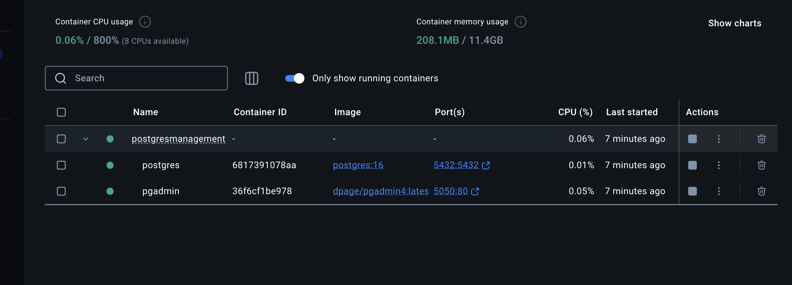
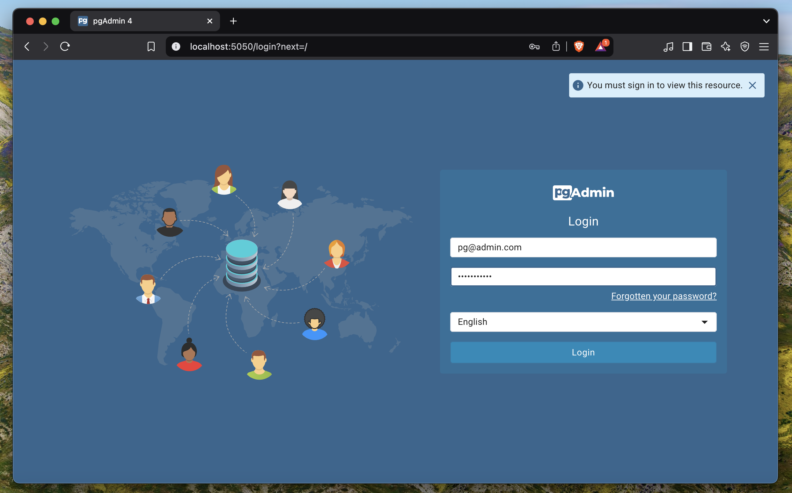
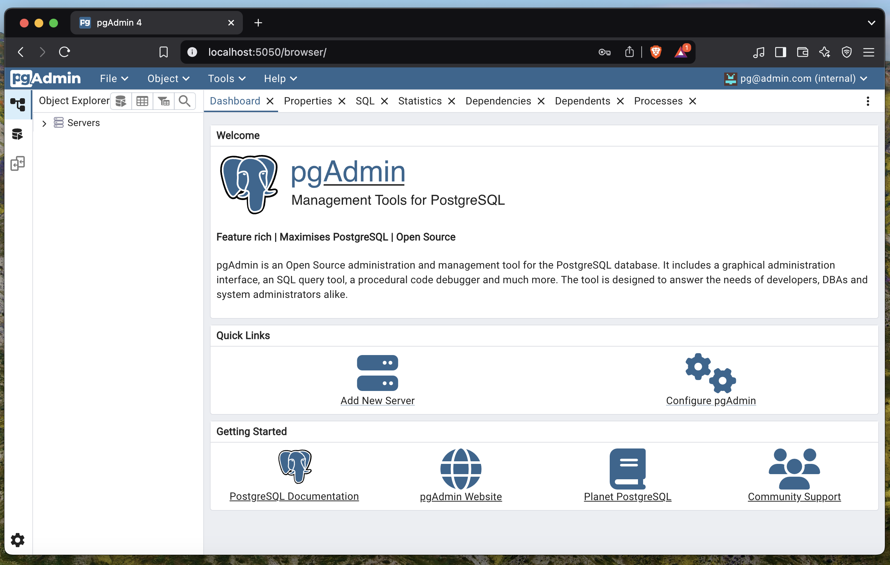
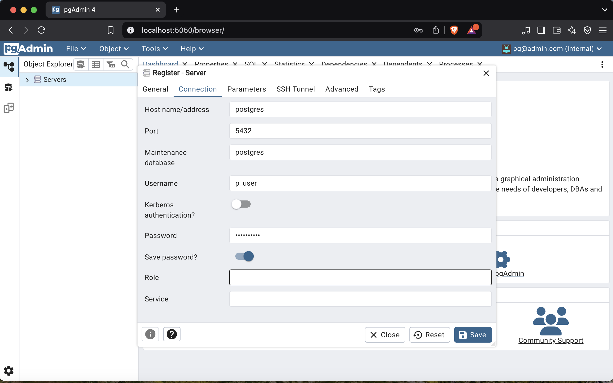
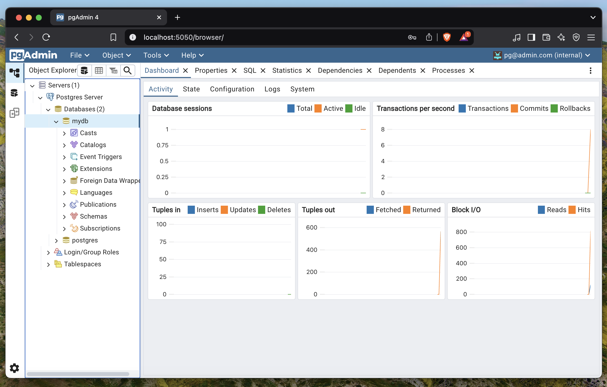

# Postgres Management | Configuration as a Code

Easily manage your postgreSQL with pgAdmin on Docker.


## Prerequisites
    - Docker Desktop (or Docker Engine and Docker Compose) installed on your system. 
    - Docker installed on your system: [https://www.docker.com/get-started/](https://www.docker.com/get-started/)


## Getting Started

1. Clone the repository:
    ```sh
    git clone https://github.com/leoncebali/PostgresManagement.git
    cd PostgresManagement
    ```

2. Create a new file under the folder and name it .env
   copy the .env-template content and paste it 

3. Start the services:
    ```sh
    docker compose up -d
    ```

### On docker, containers are now running after that



4. Access pgAdmin:
    - Open your browser and go to `http://localhost:5050`
    - Login with the following credentials:
        - **Email:** `pg@admin.com`
        - **Password:** `pg_password`

### pgAdmin started on localhost:5050




### After login




5. Connect pgAdmin to PostgreSQL:
    - Add a new server in pgAdmin:
        - **Name:** `Postgres Server`
        - **Host:** `postgres`
        - **Port:** `5432`
        - **Username:** `p_user`
        - **Password:** `p_password`

### New server configuration




### After the configuration, you will be able to enjoy your database




6. Stop the services: 
    ```sh
    docker compose down 
    ```


## Resources

- [PostgreSQL Docker Image](https://hub.docker.com/_/postgres)
- [pgAdmin Docker Image](https://hub.docker.com/r/dpage/pgadmin4)


## Services

- **PostgreSQL**
    - **Image:** `postgres:16`
    - **Port:** `5432`
    - **Environment Variables:**
        - `POSTGRES_USER`: `p_user`
        - `POSTGRES_PASSWORD`: `p_password`
        - `POSTGRES_DB`: `mydb`
    - **Volumes:**
        - `postgres-data:/var/lib/postgresql/data`

- **pgAdmin**
    - **Image:** `dpage/pgadmin4:latest`
    - **Port:** `5050`
    - **Environment Variables:**
        - `PGADMIN_DEFAULT_EMAIL`: `pg@admin.com`
        - `PGADMIN_DEFAULT_PASSWORD`: `pg_password`
    - **Volumes:**
        - `pgadmin-data:/var/lib/pgadmin`

## Volumes

- `postgres-data`: Stores PostgreSQL data
- `pgadmin-data`: Stores pgAdmin data

## Networks

- `postgres-network`: Network for PostgreSQL and pgAdmin services

## License

This project is licensed under the MIT License - see the [LICENSE](LICENSE) file for details.
